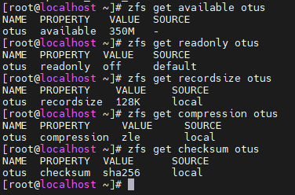

# ZFS
## Определение алгоритма с наилучшим сжатием
1. ``` vagrant up ```  поднимаем виртуальную машину
2. ``` sudi -i ```
3. Создаём пул из двух дисков в режиме RAID 1   Смотрим информацию о пулах: ``` zpool list ```
4. 
5. Добавим разные алгоритмы сжатия в каждую файловую систему и проверим, что все файловые системы имеют разные методы сжатия
6. 
7. Скачаем один и тот же текстовый файл во все пулы и проверим ``` ls -l /otus* ```    ``` zfs list ```   ``` zfs get all | grep compressratio | grep -v ref ```
8. 
9. Алгоритм **gzip-9** самый эффективный по сжатию
## Определение настроек пула
1. Скачиваем архив в домашний каталог: ``` wget -O archive.tar.gz --no-check-certificate 'https://drive.usercontent.google.com/download?id=1MvrcEp-WgAQe57aDEzxSRalPAwbNN1Bb&export=download' ```
2. Разархивируем его: ``` tar -xzvf archive.tar.gz ```
3.  ``` zpool import -d zpoolexport/ ```   вывод показывает нам имя пула, тип raid и его состав
4.  
5.  импорт пула в ОС  ``` zpool import -d zpoolexport/ otus ```
6.  Запрос сразу всех параметром файловой системы: ``` zfs get all otus ```
7.  С помощью команд можно уточнить конкретный параметр системы: ``` zfs get available otus ``` ``` zfs get readonly otus ``` ``` zfs get recordsize otus ```  ``` zfs get compression otus ``` ``` zfs get checksum otus ```
8.  
